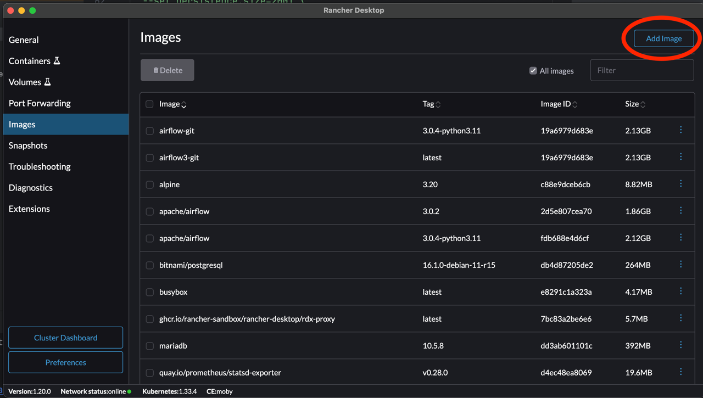

# Apache Airflow 3 on Kubernetes 

In this tutorial, we are going to spin Apache airflow v3.0.4 on Kubernetes which ofcourse use KubernetesExecutor. 
Watch complete video guide here;

# Requirements: 

following are the list of tools and their versions used in this tutorial; 
### [rancher-desktop](https://rancherdesktop.io/): 

```1.20.0 (using Dockerd container engine)```

### [kubectl](https://kubernetes.io/docs/reference/kubectl/): 
A command line tool for communicating with a Kubernetes cluster.
```
Client Version: v1.34.0
Kustomize Version: v5.7.1
Server Version: v1.33.4+k3s1
```

### [k9s](https://k9scli.io/): 
CLI tool to manage your k8s clusters.

```0.40.5```


### [helm](https://helm.sh/): 
The package manager for Kubernetes

```version.BuildInfo{Version:"v3.18.6", GitCommit:"b76a950f6835474e0906b96c9ec68a2eff3a6430", GitTreeState:"clean", GoVersion:"go1.24.6"}```

### [Nfs Server provisioner](https://artifacthub.io/packages/helm/kvaps/nfs-server-provisioner): 
A dynamic provisioner for Kubernetes, to quickly & easily deploy shared storage that works almost anywhere.

```
helm Chart version nfs-server-provisioner-1.8.0
App version 4.0.8
```

### Apache Airflow: 

```
apache/airflow:3.0.4-python3.11
```

## Prep work
Before deploying airflow, there are few things to set up first. 

### K8s Cluster
Be sure rancher has spun up your k8s cluster and rite context is selected. By default, rancher names the k8s context as `rancher-desktop`. Check if its present in context list. type `kubectl config get-contexts` to list all your k8s clusters contexts.
Then type `kubectl config use-context rancher-desktop`

### Database
I prefer MySql (over Postgres). Airflow helm chart by default comes with PSQL, so we will disable that from helm values, 
and spin up our own mysql server on k8s namespace `airflow`. Type;

```
kubectl create namespace airflow
kubectl create -f mysql_dep.yaml -n airflow
```

### NFS (Network File System)
Reason we need this is because airflow creates a persistent volume with RWX (read-write-many) accessType, which is required to persist logs. 
That's because multiple components (including workers) uses this storage to dump logs directly. You'll see this error when trying to deploy airflow 
while setting `logs.persistence.enabled: true`

```
│ Warning  ProvisioningFailed    39s (x4 over 2m24s)  rancher.io/local-path_local-path-provisioner-774c6665dc-8rjk9_114262e4-8523-4 │
│ 2e3-be7f-6ba67e7ae561  failed to provision volume with StorageClass "local-path": NodePath only supports ReadWriteOnce and ReadWrit │
│ eOncePod (1.22+) access modes 
```

On Rancher Desktop, the built-in local-path class is RWO-only, so it can’t satisfy Airflow’s logs claim. 

#### Solution: 
A dynamic RWX StorageClass with an In-cluster NFS server.

```
helm repo add kvaps https://kvaps.github.io/charts
helm repo update

helm -n nfs-system install nfs-server kvaps/nfs-server-provisioner \     
  -n nfs-system --create-namespace \
  --set persistence.enabled=true \
  --set persistence.size=20Gi \
  --set storageClass.name=nfs-rwx \
  --set storageClass.defaultClass=false \
  --set storageClass.mountOptions="{vers=4.1,retrans=2,timeo=30}" \
  --set persistence.storageClass=local-path 
```

This chart deploys an NFS server and a provisioner that serves a ReadWriteMany StorageClass (you can pick any name; I used nfs-rwx). 
we will use this storageClass `nfs-rwx` to tell airflow to dump logs in. 

### Airflow custom image
Sure, you can use your custom docker image, just like i did (Dockerfile provided) which installs apache-airflow-providers-git.
Go to Rancher Desktop main window, click `Add Image` under Images section



Click `build`, provide the image name and tag e.g. `airflow-git3`. if no tag is provided, it will create `latest` by default. 
and then click `Build`. This creates an image which is accessible to all pods from within the k8s cluster. 

## Deploy Airflow

Once all prep work is done; you are ready to deploy airflow. 

Before deploy, make sure correct values in values.yaml is applied. especially the image (line 3, 4 & 10) and storageClass (line 34)

Install the helm chart:

```
helm install airflow apache-airflow/airflow --namespace airflow -f values.yaml
```

This should deploy all required airflow components.
To upgrade helm chart, simply replace `install` with `upgrade` in above command. And similarly to delete the chart type `helm delete airflow --namespace airflow`


